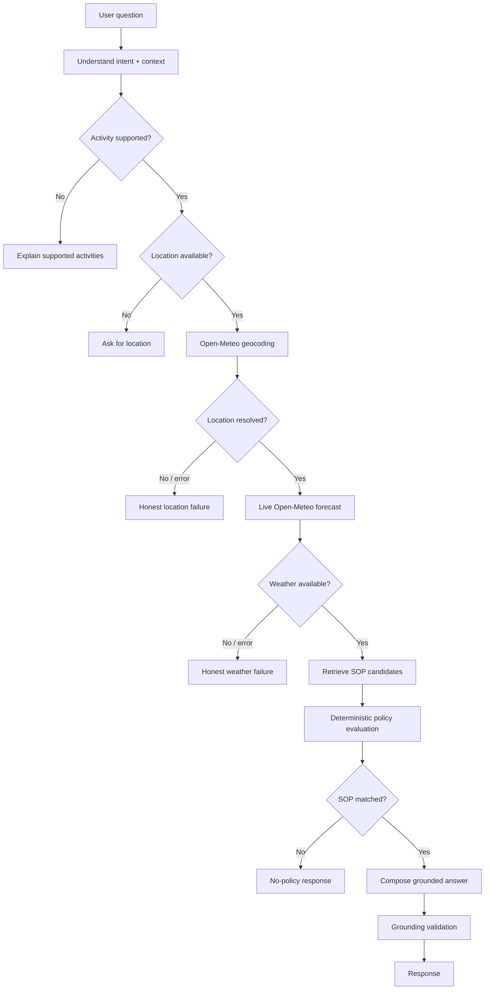

# Weatherwise — Weather-Advisory Support Bot

Weatherwise is a conversational weather-advisory application for questions such as “Is it safe to cycle today?” or “Is this a good day for a picnic?”. It combines live Open-Meteo weather data, a LangGraph workflow, LLM-assisted intent extraction, and a configuration-driven SOP engine to produce recommendations that stay tied to explicit weather conditions and written policies.

The central design choice is simple: the language model does not decide what is safe. It helps understand the user's request. The application retrieves the live forecast, evaluates the configured SOPs deterministically, and builds the response from validated facts.

## Features

### Conversational weather advice

Users can ask natural-language questions about activities including cycling, running, hiking, walking, picnics, pet walking, park visits, commuting and outdoor leisure.

The request is normalized into structured intent:

- activity
- category
- location
- time reference
- advisory intent

When an LLM provider is configured, the backend requests structured output and validates it with Pydantic. When no provider key is available, a bounded local extractor keeps the core application runnable.

### Live location and weather

Locations are resolved through the Open-Meteo geocoding service and the resulting coordinates are used for the forecast request.

Weather is fetched at request time from Open-Meteo. The application requests and carries the fields needed by the SOP set, including:

- temperature
- wind speed
- precipitation
- precipitation probability
- UV index
- WMO weather code

Time phrases such as **today**, **now**, **this afternoon**, **this evening**, **tonight** and **tomorrow** are mapped to a forecast hour. The returned timestamp and timezone stay attached to the weather facts.

There is no production fallback to invented or stale weather. When the upstream service fails, the workflow stops with an explicit service-unavailable response.

### SOP-grounded recommendations

Advisory rules are stored in:

`config/sops.yaml`

The repository contains policies across outdoor exercise, travel, leisure and vulnerable-group scenarios, with severities ranging from `LOW` to `CRITICAL`.

Each policy defines structured information such as:

- policy ID
- title
- category
- supported activities
- severity
- priority
- conditions
- guidance
- required weather fields
- version

This keeps policy data separate from graph control flow. New rules can be added through configuration without writing a new code branch for each SOP.

### Deterministic policy engine

The policy engine evaluates SOP conditions against actual application state rather than asking the LLM to make the safety decision.

Supported scalar operators include:

`eq`, `neq`, `gt`, `gte`, `lt`, `lte`, `in`, `contains`

Conditions can be composed with:

`all`, `any`, `not`

Every activity-specific candidate is evaluated, then the matching policies are resolved using severity followed by explicit priority. The evaluation trace is retained so the selected policy can be explained.

The same mechanism handles fuzzy questions such as picnic suitability through combinations of forecast signals instead of relying on a single keyword or a free-form model judgment.

### LangGraph orchestration

The backend uses a real LangGraph `StateGraph` with explicit conditional routes.



The graph state carries the request, session context, resolved location, weather facts, policy candidates, decision result, status and trace between nodes.

### Session-aware follow-ups

Each chat uses a `session_id`. The backend keeps lightweight in-process context for the current conversation.

For example:

```text
User: Can I cycle in Bhopal today?
Assistant: ...

User: What about this evening?
Assistant: ...
```

The second turn can reuse the earlier activity and location instead of asking the user to repeat them.

Session memory is intentionally ephemeral and is not shared across unrelated sessions.

### Grounding and guardrails

The system treats weather data and policy definitions as authoritative inputs.

Before a successful response is returned, the application validates that:

- the selected SOP exists in the loaded configuration
- the SOP actually matched the current facts
- the policy reference is present in the answer
- displayed weather values originate from the fetched weather state
- the weather timestamp is carried through when available

If no SOP matches, the application does not invent generic advice. It explicitly reports that the current policy set does not cover the situation.

Missing locations, invalid upstream responses and service failures follow the same fail-honestly approach.

### Prompt-injection resistance

User text is treated as untrusted input. Instructions such as “ignore the SOPs”, “pretend the weather is safe”, or “invent a new policy” cannot modify the deterministic policy engine or create an application rule.

The LLM is constrained to language understanding and composition. It does not own weather facts or the final policy decision.

### Engineering trace

The frontend provides an expandable execution trace for each advisory. It shows structured system events such as:

```text
intent detected
location resolved
live weather retrieved
candidate SOPs evaluated
policy selected
grounding validation passed
```

The trace is intended to show what the application did without exposing hidden model reasoning.

## Architecture

The project is split into a Next.js client and a small FastAPI service. LangGraph coordinates the request lifecycle, Open-Meteo supplies live location/weather data, and the SOP engine owns the actual policy decision.

```text
┌──────────────────────┐
│      Next.js UI      │
│  Chat + Weather UI   │
│  SOP + Trace panels  │
└──────────┬───────────┘
           │ REST / JSON
           ▼
┌──────────────────────┐
│       FastAPI        │
│ Request validation   │
│ CORS + API boundary  │
└──────────┬───────────┘
           ▼
┌──────────────────────────────────┐
│          LangGraph               │
│                                  │
│ Intent / Context                 │
│        ↓                         │
│ Location Resolution              │
│        ↓                         │
│ Live Weather                     │
│        ↓                         │
│ SOP Retrieval                    │
│        ↓                         │
│ Deterministic Policy Evaluation  │
│        ↓                         │
│ Grounded Response + Validation   │
└──────┬─────────────┬─────────────┘
       │             │
       ▼             ▼
┌────────────┐  ┌─────────────────┐
│ Open-Meteo │  │ config/sops.yaml│
│ Geocoding  │  │ Policy source   │
│ Forecast   │  │                 │
└────────────┘  └─────────────────┘
```

### Responsibility boundaries

| Layer | What it does |
|---|---|
| **Frontend** | Collects questions, displays conversation, weather facts, policy information and trace data |
| **FastAPI** | Validates requests and exposes the REST API |
| **LangGraph** | Orchestrates state, branching and failure paths |
| **LLM layer** | Extracts structured user intent when configured |
| **Open-Meteo** | Resolves locations and supplies live forecast values |
| **SOP configuration** | Defines the written advisory policies |
| **Policy engine** | Evaluates conditions and selects the applicable policy |
| **Session store** | Maintains lightweight context for follow-up turns |
| **Validation** | Ensures the final response remains tied to actual state |

## Tech stack

### Frontend

- **Next.js 16**
- **React 19**
- **TypeScript**
- **Tailwind CSS 4**
- **shadcn-style UI primitive**
- **Lucide React**
- **Framer Motion**

### Backend

- **Python 3.11+**
- **FastAPI**
- **LangGraph**
- **Pydantic v2**
- **httpx**
- **PyYAML**
- **python-dotenv**

### AI / LLM

- **LLM-assisted intent extraction**
- **Structured JSON / JSON Schema output**
- **Pydantic validation**
- **Prompt and context-aware extraction**
- **OpenAI / OpenAI-compatible provider integration**

The LLM is deliberately kept behind the policy boundary. It interprets the question but does not decide the advisory.

### APIs and communication

- **REST API** for frontend-to-backend communication
- **Open-Meteo Geocoding API**
- **Open-Meteo Forecast API**
- **HTTP/JSON** for upstream weather requests

### Policy and decision layer

- **YAML-based SOP configuration**
- **Declarative rule evaluation**
- **Deterministic policy selection**
- **Severity and priority resolution**
- **Structured decision tracing**
- **Grounding validation**

### Testing

- **Pytest**
- **pytest-asyncio**
- API tests
- Policy-engine tests
- Weather-service tests
- Session-memory tests
- Structured-intent tests
- Offline evaluation cases

## RAG status

This repository does **not** currently use a vector database, embeddings, or a conventional semantic RAG pipeline.

That is intentional. The policy corpus is small, structured, and rule-oriented, so direct configuration loading plus deterministic condition evaluation is a better fit than introducing a retrieval stack that would not add value here.

The application still has an explicit retrieval step: candidate SOPs are selected from the external policy configuration before deterministic evaluation. This is policy retrieval, not vector-based RAG.

## API

### `POST /api/chat`

Request:

```json
{
  "session_id": "your-session-id",
  "message": "Is it safe to cycle in Bhopal today?"
}
```

A successful response can contain:

- `status`
- `answer`
- `location`
- `weather`
- `policy`
- `trace`

Use the same `session_id` for follow-up questions.

### `GET /health`

Returns the backend health status.

## Project structure

```text
Weather_Bot/
├── backend/
│   ├── app/
│   │   ├── graph.py
│   │   ├── llm.py
│   │   ├── main.py
│   │   ├── models.py
│   │   └── services.py
│   ├── tests/
│   └── requirements.txt
│
├── config/
│   └── sops.yaml
│
├── docs/
│   ├── architecture.md
│   ├── decisions.md
│   └── evaluation.md
│
├── evals/
│   ├── cases.yaml
│   ├── run.py
│   └── README.md
│
├── frontend/
│   ├── app/
│   ├── components/
│   ├── lib/
│   └── package.json
│
├── .env.example
├── .gitignore
├── pytest.ini
└── README.md
```

## Run locally

### Prerequisites

- Python 3.11+
- Node.js 20+
- npm
- Internet access for Open-Meteo
- Optional LLM provider credentials

No weather API key is required.

### Backend

From the repository root:

```bash
cd backend
python -m venv .venv
```

Windows PowerShell:

```powershell
.\.venv\Scripts\Activate.ps1
```

macOS/Linux:

```bash
source .venv/bin/activate
```

Install dependencies:

```bash
pip install -r requirements.txt
```

Create a backend `.env` using the variables documented in `.env.example`.

Start the API:

```bash
uvicorn app.main:app --reload
```

The backend runs on:

```text
http://localhost:8000
```

### Frontend

In another terminal:

```bash
cd frontend
npm install
npm run dev
```

Open:

```text
http://localhost:3000
```

Set `NEXT_PUBLIC_API_URL` when the frontend needs to call a deployed backend.

## Testing

Run the backend tests from the repository root:

```bash
python -m pytest -q
```

Run the lightweight evaluation suite:

```bash
python evals/run.py
```

The test suite covers core policy evaluation, API validation, weather-service behavior, structured intent extraction and session context.

Weather-dependent behavior is kept separate from deterministic policy tests because live forecast values change over time.

## Adding or changing an SOP

Policies live in:

```text
config/sops.yaml
```

An SOP defines the activities it applies to and its conditions. The graph does not contain a branch for an individual policy ID.

A new policy can therefore be added without changing the workflow implementation:

```yaml
- id: WB-NEW
  title: Example Outdoor Condition
  category: leisure
  activities: [picnic]
  severity: LOW
  priority: 20
  conditions:
    all:
      - {field: precipitation_probability, operator: lt, value: 30}
      - {field: wind_speed_10m, operator: lt, value: 25}
  guidance:
    - "Use the guidance defined by this policy."
```

After configuration reload, the existing policy engine can evaluate it using the same generic operators.

## Design principles

**Live facts stay live.** Weather measurements come from Open-Meteo at request time.

**Policies stay explicit.** Advisory logic lives in configuration instead of being hidden in prompts.

**The LLM has a narrow role.** It helps interpret natural language but cannot override deterministic policy evaluation.

**Failures stay honest.** Missing information or unavailable upstream services do not turn into plausible-looking guesses.

**The application is traceable.** Each response carries structured location, weather, policy and execution information.

## Scope

Weatherwise is a focused outdoor-advisory application rather than a general weather platform. The supported activity and time vocabulary is intentionally bounded, session context is process-local, and the SOP thresholds are application-defined policies rather than a replacement for official weather or emergency guidance.

## License

This project is provided for educational and application-development use.
