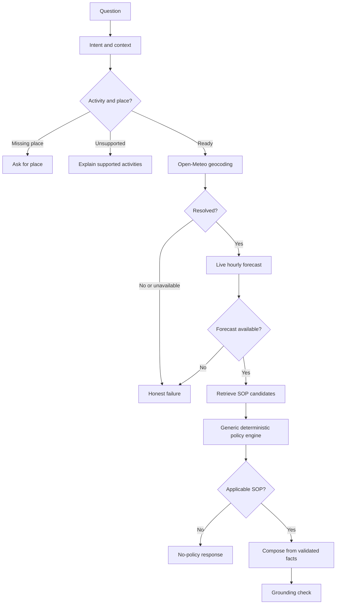

# Architecture

The API accepts a user question and session identifier. A typed LangGraph `StateGraph` extracts supported activity, place and a time phrase, uses session context when the question is elliptical, resolves the place with Open-Meteo geocoding, fetches a live hourly forecast, retrieves configuration-defined SOPs, evaluates their conditions, chooses a deterministic winner, and validates the response before returning it.

## Components

- **FastAPI** validates bounded inputs and exposes `/health` and `/api/chat`.
- **LangGraph** owns the actual conditional workflow; failure and missing-information routes end before policy evaluation.
- **Open-Meteo** supplies geocoding and current/forecast-hour weather; upstream failures never lead to cached or invented conditions.
- **SOP YAML** is loaded outside graph code. The evaluator supports `all`, `any`, `not`, and scalar operators, and records per-policy decisions.
- **Session memory** is an in-process map keyed by caller-generated session ID. It keeps activity and place for follow-up turns; it is intentionally ephemeral and single-process.
- **Next.js UI** displays the answer, weather facts, citation, and decision trace. Tailwind provides utility styling and the local shadcn-style button primitive keeps the controls consistent. Browser session storage holds only a random session ID.

## Trust boundaries

Intent extraction uses a configured OpenAI-compatible structured-output provider when `OPENAI_API_KEY` is set; Pydantic validates the result against allowed activities, categories and time phrases. With no provider key, a conservative local parser keeps the app runnable. In either mode intent extraction has no authority to decide safety. Weather values come only from an Open-Meteo response. Advice comes only from matched configured SOP guidance. User text cannot add policies or override evaluator output.
